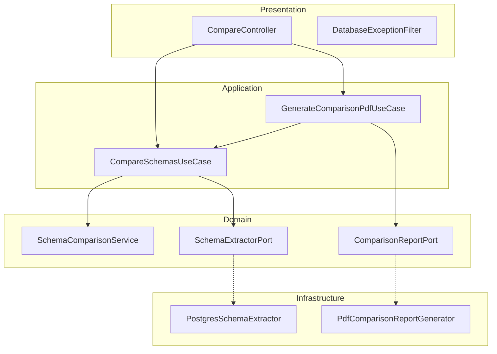

# DB Schema Comparator

API em **NestJS** e **TypeScript** para comparar schemas PostgreSQL entre dois bancos. Detecta diferenças estruturais e devolve **JSON** ou **relatório PDF**.

[](https://nestjs.com/)
[](https://www.typescriptlang.org/)
[](https://www.postgresql.org/)
[](https://github.com/Ricardo-1976/db-schema-comparator)

**Repositório:** [github.com/Ricardo-1976/db-schema-comparator](https://github.com/Ricardo-1976/db-schema-comparator)

---

## Sobre

Divergências de schema entre ambientes (dev, staging, prod) causam bugs silenciosos. Esta API compara dois bancos PostgreSQL (schema `public`) e reporta diferenças em tabelas, colunas, PKs, FKs, índices e constraints.

Arquitetura **Clean Architecture** + **Hexagonal** (Ports & Adapters).

---

## Funcionalidades

| Recurso | Status |
|---------|--------|
| Comparação estrutural (Nível 1) | ✅ |
| `POST /compare` — JSON | ✅ |
| `POST /compare/pdf` — PDF | ✅ |
| Swagger em `/api/docs` | ✅ |
| Docker (prod + dev) | ✅ |
| Testes unitários e e2e | ✅ |
| Views, functions, comparação de dados | 🔜 |

---

## Quick start

### Pré-requisitos

- Node.js 18+
- Dois bancos PostgreSQL acessíveis

### Instalação

```bash
git clone git@github.com:Ricardo-1976/db-schema-comparator.git
cd db-schema-comparator
npm install
npm run start:dev
```

- API: `http://localhost:3000`
- Swagger: `http://localhost:3000/api/docs`

### Scripts

| Comando | Descrição |
|---------|-----------|
| `npm run start:dev` | Desenvolvimento com hot reload |
| `npm run build` | Compila para `dist/` |
| `npm run start:prod` | Produção |
| `npm test` | Testes unitários |
| `npm run test:e2e` | Testes end-to-end |
| `npm run test:cov` | Cobertura de testes |
| `npm run lint` | ESLint |

---

## Docker

```bash
# Produção
docker compose up --build -d

# Desenvolvimento (hot reload)
docker compose -f docker-compose.dev.yml up --build
```

| Ficheiro | Uso |
|----------|-----|
| `docker-compose.yml` | API compilada (`node dist/main.js`) |
| `docker-compose.dev.yml` | `npm run start:dev` com volume local |

**API no Docker + PostgreSQL no PC:** use `host.docker.internal` como `host` no body.

Após `npm install` de novas dependências no modo dev:

```bash
docker compose -f docker-compose.dev.yml down -v
docker compose -f docker-compose.dev.yml up --build
```

---

## Swagger

| Recurso | URL |
|---------|-----|
| UI | `http://localhost:3000/api/docs` |
| OpenAPI JSON | `http://localhost:3000/api/docs/openapi.json` |

Configuração em `src/docs/swagger.config.ts`.

---

## Testes

```bash
npm test              # unitários
npm run test:e2e      # HTTP + Swagger (mock do extractor)
npm run test:cov      # cobertura
```

Cobertura principal: `SchemaComparisonService`, formatters, erros de conexão, use cases, filter HTTP e endpoints `POST /compare` / `POST /compare/pdf`.

---

## API

### Request body

```json
{
  "dbA": {
    "host": "localhost",
    "port": 5432,
    "user": "postgres",
    "password": "secret",
    "database": "db_source"
  },
  "dbB": {
    "host": "localhost",
    "port": 5432,
    "user": "postgres",
    "password": "secret",
    "database": "db_target"
  }
}
```

- **dbA** = source · **dbB** = target
- Schema comparado: `public` (apenas `BASE TABLE`)
- Timeout de conexão: **5 segundos**

### Endpoints

| Método | Rota | Resposta |
|--------|------|----------|
| `POST` | `/compare` | JSON `{ summary, differences }` |
| `POST` | `/compare/pdf` | Arquivo PDF |

### Exemplo

```bash
curl -X POST http://localhost:3000/compare \
  -H "Content-Type: application/json" \
  -d '{
    "dbA": { "host": "localhost", "port": 5432, "user": "postgres", "password": "secret", "database": "db1" },
    "dbB": { "host": "localhost", "port": 5432, "user": "postgres", "password": "secret", "database": "db2" }
  }'
```

### Tipos de diferença

| `type` | Descrição |
|--------|-----------|
| `TABLE_MISSING` | Tabela existe só num banco |
| `COLUMN_MISSING` | Coluna ausente |
| `COLUMN_TYPE` | Tipo divergente |
| `COLUMN_NULLABLE` | Nullable divergente |
| `PRIMARY_KEY` | PK ausente ou diferente |
| `FOREIGN_KEY` | FK ausente ou diferente |
| `INDEX` | Índice ausente ou diferente |
| `CONSTRAINT` | UNIQUE/CHECK ausente ou diferente |

### Erros de conexão

| `reason` | HTTP |
|----------|------|
| `AUTH_FAILED`, `INVALID_DATABASE` | 400 |
| `UNREACHABLE`, `TIMEOUT` | 502 |
| `UNKNOWN` | 503 |

---

## Arquitetura



```
src/
├── domain/          # entidades, contratos, ports, services
├── application/     # use cases
├── infrastructure/  # PostgreSQL, PDF
├── presentation/    # controllers, DTOs, filters
└── docs/            # Swagger
```

---

## Stack

NestJS 11 · TypeScript 5.7 · PostgreSQL (`pg`) · PDFKit · Swagger · Docker · Jest · Supertest

---

## Roadmap

- [x] Nível 1 — schema estrutural, JSON, PDF, Swagger, Docker, testes
- [ ] Nível 2 — views, functions, triggers, sequences, enums
- [ ] Nível 3 — comparação de dados
- [ ] Múltiplos schemas, MySQL/MongoDB adapters

---

## Autor

**Ricardo Antonio**

Projeto de portfólio backend — arquitetura escalável, engenharia de dados e design de sistemas.

```bash
git clone git@github.com:Ricardo-1976/db-schema-comparator.git
```
