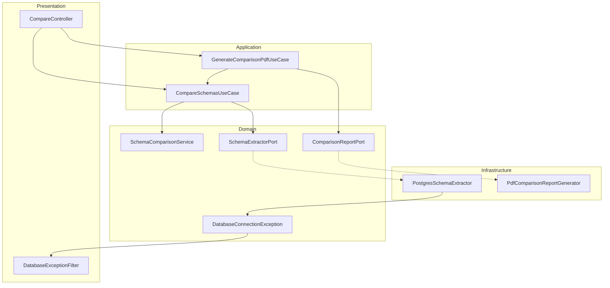

# DB Schema Comparator

API em **NestJS** e **TypeScript** para comparar schemas PostgreSQL entre dois bancos. Projeto de portfólio com **Clean Architecture** e **Arquitetura Hexagonal**.

[](https://nestjs.com/)
[](https://www.typescriptlang.org/)
[](https://www.postgresql.org/)
[]()

---

## Problema

Divergências de schema entre ambientes (dev/staging/prod) geram bugs silenciosos. Esta API detecta **diferenças estruturais** entre dois bancos PostgreSQL e devolve JSON ou relatório PDF.

---

## Funcionalidades

| Recurso | Status |
|---------|--------|
| Comparação Nível 1: tabelas, colunas, PK, FK, índices, constraints | ✅ |
| `POST /compare` — resposta JSON | ✅ |
| `POST /compare/pdf` — relatório PDF | ✅ |
| Extração via `information_schema` + `pg_catalog` | ✅ |
| Tipos de coluna normalizados (`VARCHAR(n)`, `NUMERIC(p,s)`, etc.) | ✅ |
| Tratamento de erros de conexão (timeout 5s, filter HTTP) | ✅ |
| Validação de payload com `class-validator` | ✅ |
| DI NestJS + Ports & Adapters | ✅ |
| Níveis 2 (objetos) e 3 (dados) | 🔜 |
| Swagger, testes, outros SGBDs, múltiplos schemas | 🔜 |

---

## Quick start

### Pré-requisitos

- Node.js 18+
- Dois bancos PostgreSQL acessíveis (ou o mesmo host com databases diferentes)

### Instalação e execução

```bash
git clone <url-do-repositorio>
cd db-schema-comparator
npm install
npm run start:dev
```

API em `http://localhost:3000`.

### Scripts

| Comando | Descrição |
|---------|-----------|
| `npm run start:dev` | Desenvolvimento com hot reload |
| `npm run build` | Compila para `dist/` |
| `npm run start:prod` | Produção |
| `npm run lint` | ESLint |
| `npm run test` | Jest |
| `npm run test:cov` | Cobertura de testes |

---

## API

### Body comum (`dbA` e `dbB`)

```json
{
  "dbA": {
    "host": "localhost",
    "port": 5432,
    "user": "postgres",
    "password": "secret",
    "database": "db_source"
  },
  "dbB": {
    "host": "localhost",
    "port": 5432,
    "user": "postgres",
    "password": "secret",
    "database": "db_target"
  }
}
```

| Campo | Validação |
|-------|-----------|
| `host`, `user`, `password`, `database` | string, obrigatório |
| `port` | inteiro entre 1 e 65535 |

- **Database A** = `dbA` (source na comparação)
- **Database B** = `dbB` (target na comparação)
- Schema comparado: `public` (apenas `BASE TABLE`)

---

### `POST /compare`

Retorna JSON com `summary` e lista plana `differences`.

**Response `200 OK`**

```json
{
  "summary": {
    "tablesCompared": 52,
    "equal": 46,
    "different": 6
  },
  "differences": [
    {
      "table": "customer",
      "type": "COLUMN_TYPE",
      "column": "name",
      "databaseA": "VARCHAR(100)",
      "databaseB": "VARCHAR(255)"
    },
    {
      "table": "users",
      "type": "COLUMN_MISSING",
      "column": "phone",
      "existsIn": "Database A"
    },
    {
      "table": "invoice",
      "type": "TABLE_MISSING",
      "existsIn": "Database B"
    },
    {
      "table": "users",
      "type": "PRIMARY_KEY",
      "constraint": "users_pkey",
      "databaseA": "(id)",
      "databaseB": "(id, tenant_id)"
    },
    {
      "table": "orders",
      "type": "FOREIGN_KEY",
      "constraint": "fk_orders_customer",
      "databaseA": "user_id → customer(id) ON DELETE CASCADE ON UPDATE NO ACTION",
      "databaseB": "user_id → customer(id) ON DELETE RESTRICT ON UPDATE NO ACTION"
    },
    {
      "table": "users",
      "type": "INDEX",
      "constraint": "idx_users_email",
      "databaseA": "UNIQUE btree (email)",
      "databaseB": "btree (email)"
    },
    {
      "table": "products",
      "type": "CONSTRAINT",
      "constraint": "products_price_check",
      "databaseA": "CHECK ((price > 0))",
      "databaseB": "CHECK ((price >= 0))"
    }
  ]
}
```

#### `summary`

| Campo | Significado |
|-------|-------------|
| `tablesCompared` | Total de tabelas na união dos dois bancos (A ∪ B) |
| `equal` | Tabelas sem nenhuma diferença |
| `different` | Tabelas com pelo menos uma diferença |

`equal + different = tablesCompared`

#### Tipos de `differences`

| `type` | Descrição | Campos extras |
|--------|-----------|---------------|
| `TABLE_MISSING` | Tabela existe só em um banco | `existsIn`: `Database A` ou `Database B` |
| `COLUMN_MISSING` | Coluna ausente em um banco | `column`, `existsIn` |
| `COLUMN_TYPE` | Tipo divergente | `column`, `databaseA`, `databaseB` |
| `COLUMN_NULLABLE` | Nullable divergente | `column`, `databaseA`, `databaseB` (`NULL` / `NOT NULL`) |
| `PRIMARY_KEY` | PK ausente ou colunas diferentes | `constraint`, `existsIn` ou `databaseA`/`databaseB` |
| `FOREIGN_KEY` | FK ausente ou regras diferentes | `constraint`, `existsIn` ou `databaseA`/`databaseB` |
| `INDEX` | Índice ausente ou definição diferente | `constraint`, `existsIn` ou `databaseA`/`databaseB` |
| `CONSTRAINT` | UNIQUE ou CHECK ausente/diferente | `constraint`, `existsIn` ou `databaseA`/`databaseB` |

**Exemplo cURL**

```bash
curl -X POST http://localhost:3000/compare \
  -H "Content-Type: application/json" \
  -d '{
    "dbA": { "host": "localhost", "port": 5432, "user": "postgres", "password": "secret", "database": "db1" },
    "dbB": { "host": "localhost", "port": 5432, "user": "postgres", "password": "secret", "database": "db2" }
  }'
```

---

### `POST /compare/pdf`

Mesmo body de `POST /compare`. Retorna um arquivo PDF para download.

**Headers de resposta**

- `Content-Type: application/pdf`
- `Content-Disposition: attachment; filename="schema-comparison.pdf"`

**Seções do relatório**

1. Capa (bancos, status de compatibilidade)
2. KPIs (`summary`)
3. Visão geral narrativa das diferenças
4. Diferenças detalhadas agrupadas por categoria (tabela)
5. Inventário do schema — Database A
6. Inventário do schema — Database B

**Exemplo cURL**

```bash
curl -X POST http://localhost:3000/compare/pdf \
  -H "Content-Type: application/json" \
  -d '{
    "dbA": { "host": "localhost", "port": 5432, "user": "postgres", "password": "secret", "database": "db1" },
    "dbB": { "host": "localhost", "port": 5432, "user": "postgres", "password": "secret", "database": "db2" }
  }' \
  --output schema-comparison.pdf
```

---

### Erros de conexão

Falhas de conexão **não derrubam o servidor**. Timeout de conexão: **5 segundos**.

**Exemplo — credencial inválida** `400 Bad Request`

```json
{
  "statusCode": 400,
  "error": "Database Connection Error",
  "database": "Database A",
  "reason": "AUTH_FAILED",
  "message": "Authentication failed"
}
```

**Exemplo — host inacessível** `502 Bad Gateway`

```json
{
  "statusCode": 502,
  "error": "Database Connection Error",
  "database": "Database B",
  "reason": "UNREACHABLE",
  "message": "Could not reach database host"
}
```

| `reason` | HTTP | Situação |
|----------|------|----------|
| `AUTH_FAILED` | 400 | Usuário ou senha inválidos |
| `INVALID_DATABASE` | 400 | Database não existe |
| `UNREACHABLE` | 502 | Host/porta inacessíveis |
| `TIMEOUT` | 502 | Conexão expirou (> 5s) |
| `UNKNOWN` | 503 | Outro erro de conexão |

---

## Níveis de comparação

| Nível | Escopo | Status |
|-------|--------|--------|
| **1 — Schema** | Tabelas, colunas, PK, FK, índices, UNIQUE/CHECK | ✅ |
| **2 — Objetos** | Views, functions, procedures, triggers, sequences, enums | 🔜 |
| **3 — Dados** | Contagem, hash, diff por PK, linhas faltantes/alteradas | 🔜 |

Futuro: parâmetro `levels: [1, 2, 3]` no request (padrão: `[1]`).

---

## Arquitetura

Separação em camadas com **inversão de dependência**: o domínio define contratos (`SchemaExtractorPort`, `ComparisonReportPort`); a infraestrutura implementa os adapters.



### Módulos NestJS

```
AppModule
 └── PresentationModule
      ├── CompareController
      └── ApplicationModule
           ├── CompareSchemasUseCase
           ├── GenerateComparisonPdfUseCase
           ├── ExtractSchemaUseCase
           ├── SchemaComparisonService
           └── InfrastructureModule
                ├── SCHEMA_EXTRACTOR → PostgresSchemaExtractor
                └── COMPARISON_REPORT_GENERATOR → PdfComparisonReportGenerator
```

### Estrutura do projeto

```
src/
├── domain/
│   ├── entities/           # Schema, Table, Column, PK, FK, Index, Constraint
│   ├── contracts/          # SchemaComparisonResult, ComparisonReportInput
│   ├── ports/              # SchemaExtractorPort, ComparisonReportPort
│   ├── services/           # SchemaComparisonService, formatters
│   └── exceptions/         # DatabaseConnectionException
├── application/
│   └── use-cases/          # compare-schemas, extract-schema, generate-comparison-pdf
├── infrastructure/
│   ├── extractors/postgres/
│   └── reports/            # PdfComparisonReportGenerator
└── presentation/
    ├── controllers/
    ├── dtos/
    └── filters/
```

### Fluxo das requisições

**JSON:** `POST /compare` → `CompareSchemasUseCase` → extrai A e B em paralelo → `SchemaComparisonService` → JSON.

**PDF:** `POST /compare/pdf` → `GenerateComparisonPdfUseCase` → mesma comparação + schemas → `PdfComparisonReportGenerator` → buffer PDF.

---

## Modelo de domínio

```
SchemaEntity
 └── TableEntity[]
      ├── ColumnEntity[]        (name, type, nullable)
      ├── PrimaryKeyEntity?     (name, columns[])
      ├── ForeignKeyEntity[]    (name, columns, referencedTable, onDelete, onUpdate)
      ├── IndexEntity[]         (name, columns, unique, method)
      └── ConstraintEntity[]    (UNIQUE | CHECK)
```

Contrato de resposta em `domain/contracts/schema-comparison-result.ts`:

```
SchemaComparisonResult
 ├── summary: { tablesCompared, equal, different }
 └── differences: SchemaDifference[]
```

A comparação de colunas, PKs, FKs, índices e constraints só ocorre em tabelas com o **mesmo nome** nos dois bancos.

---

## Stack

- **Runtime:** Node.js 18+
- **Framework:** NestJS 11
- **Linguagem:** TypeScript 5.7
- **Banco:** PostgreSQL (`pg`)
- **Relatórios:** pdfkit
- **Validação:** class-validator, class-transformer
- **Qualidade:** ESLint, Prettier, Jest (configurado)

---

## Decisões de design

> *"A lógica de negócio não deve depender de frameworks nem de bancos de dados."*

- O domínio expõe interfaces (`SchemaExtractorPort`, `ComparisonReportPort`) e exceções (`DatabaseConnectionException`)
- Novos bancos ou formatos de relatório = novos adapters em `infrastructure/`, sem mudança nos use cases
- Entidades imutáveis (`readonly`) para representar snapshot de schema
- Um `Client` pg executa queries **em sequência** (evita deprecação do driver em pg@9.0)
- Extração de `dbA` e `dbB` permanece **em paralelo** (clients separados)

---

## Roadmap

### Nível 1 — Schema
- [x] Tabelas, colunas, PK, FK, índices, constraints
- [x] Resposta JSON com `summary` e `differences`
- [x] Relatório PDF exportável
- [x] DI NestJS e tratamento de erros de conexão

### Nível 2 — Objetos
- [ ] Views, functions, procedures, triggers, sequences, enums

### Nível 3 — Dados
- [ ] Contagem, hash, diff por PK, linhas faltantes/alteradas

### Infraestrutura e produto
- [ ] Parâmetro `levels` no request
- [ ] Testes unitários e e2e
- [ ] Documentação OpenAPI (Swagger)
- [ ] Adapters MySQL e MongoDB
- [ ] Suporte a múltiplos schemas PostgreSQL
- [ ] Endpoint `POST /extract` (use case já registrado no DI)

---

## Autor

Projeto de portfólio backend — arquitetura escalável, engenharia de dados e design de sistemas.
