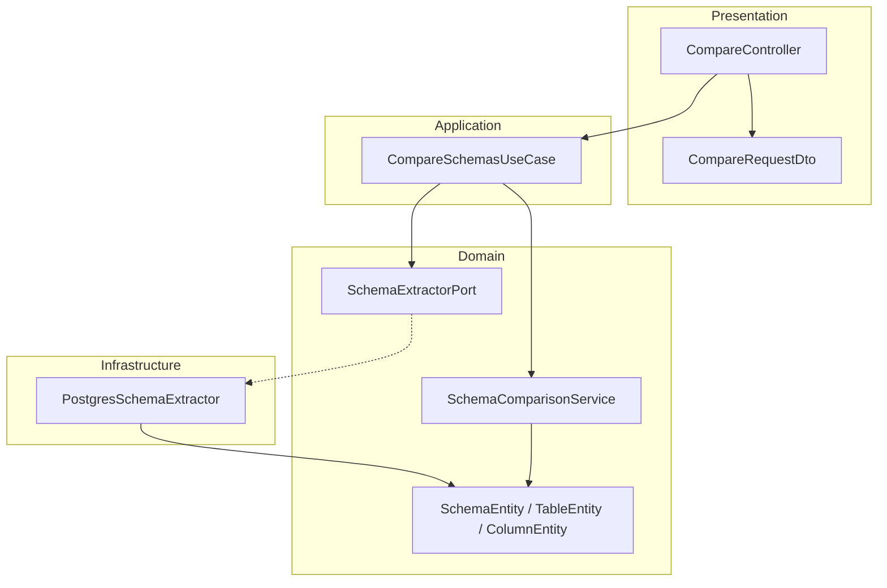

# DB Schema Comparator

API backend em **NestJS** e **TypeScript** para extrair e comparar estruturas de bancos de dados PostgreSQL. Projeto de portfólio focado em **Clean Architecture** e **Arquitetura Hexagonal**, com domínio desacoplado de frameworks e de drivers de banco.

[](https://nestjs.com/)
[](https://www.typescriptlang.org/)
[](https://www.postgresql.org/)
[]()

---

## O problema

Em migrações, ambientes paralelos (dev/staging/prod) ou integrações entre serviços, divergências de schema causam bugs silenciosos. Este projeto automatiza a **detecção de diferenças estruturais** entre dois bancos PostgreSQL via API REST.

## O que está implementado

| Funcionalidade | Status |
|---|---|
| Extração de schema PostgreSQL (`information_schema`) | ✅ |
| Comparação de **tabelas ausentes** entre dois bancos | ✅ |
| Validação de payload com `class-validator` | ✅ |
| Domínio isolado (entities, ports, services) | ✅ |
| Use cases na camada de aplicação | ✅ |
| Adapter PostgreSQL na infraestrutura | ✅ |
| Comparação de colunas e tipos | 🔜 Roadmap |
| Suporte MySQL / MongoDB | 🔜 Roadmap |
| Testes automatizados | 🔜 Roadmap |

> As colunas já são extraídas e modeladas no domínio (`ColumnEntity`); a engine de comparação hoje opera apenas no nível de **tabelas**.

---

## Arquitetura

Separação explícita em camadas, com **inversão de dependência**: o domínio define o contrato (`SchemaExtractorPort`); a infraestrutura implementa o adapter PostgreSQL.



### Estrutura do projeto

```
src/
├── domain/
│   ├── entities/          # Modelo de domínio (Schema, Table, Column)
│   ├── ports/             # Contratos (interfaces) — núcleo hexagonal
│   └── services/          # Regras de negócio (comparação)
├── application/
│   └── use-cases/         # Orquestração (extract, compare)
├── infrastructure/
│   └── extractors/
│       └── postgres/      # Adapter PostgreSQL (pg + information_schema)
├── presentation/
│   ├── controllers/       # Endpoints HTTP
│   └── dtos/              # Validação de entrada
└── shared/
    └── interfaces/        # Tipos compartilhados (DatabaseConfig)
```

### Fluxo da requisição

1. `POST /compare` recebe credenciais de dois bancos (`dbA`, `dbB`)
2. DTOs são validados pelo `ValidationPipe` global
3. `CompareSchemasUseCase` extrai o schema de cada banco via `SchemaExtractorPort`
4. `SchemaComparisonService` calcula tabelas presentes em um banco e ausentes no outro
5. Resposta JSON com o diff

---

## Stack

- **Runtime:** Node.js
- **Framework:** NestJS 11
- **Linguagem:** TypeScript 5.7
- **Banco:** PostgreSQL (`pg`)
- **Validação:** class-validator, class-transformer
- **Qualidade:** ESLint, Prettier, Jest (configurado)

---

## Como executar

### Pré-requisitos

- Node.js 18+
- Dois bancos PostgreSQL acessíveis (ou o mesmo host com databases diferentes)

### Instalação

```bash
git clone <url-do-repositorio>
cd db-schema-comparator
npm install
```

### Desenvolvimento

```bash
npm run start:dev
```

A API sobe em `http://localhost:3000`.

### Produção

```bash
npm run build
npm run start:prod
```

### Scripts úteis

| Comando | Descrição |
|---|---|
| `npm run start:dev` | Hot reload |
| `npm run build` | Compila para `dist/` |
| `npm run lint` | ESLint |
| `npm run test` | Jest |
| `npm run test:cov` | Cobertura de testes |

---

## API

### `POST /compare`

Compara os schemas de dois bancos PostgreSQL.

**Request**

```json
{
  "dbA": {
    "host": "localhost",
    "port": 5432,
    "user": "postgres",
    "password": "secret",
    "database": "db_source"
  },
  "dbB": {
    "host": "localhost",
    "port": 5432,
    "user": "postgres",
    "password": "secret",
    "database": "db_target"
  }
}
```

**Response** `200 OK`

```json
{
  "missing_in_a": ["products"],
  "missing_in_b": ["logs"]
}
```

| Campo | Significado |
|---|---|
| `missing_in_a` | Tabelas que existem em **B** mas não em **A** |
| `missing_in_b` | Tabelas que existem em **A** mas não em **B** |

**Exemplo com cURL**

```bash
curl -X POST http://localhost:3000/compare \
  -H "Content-Type: application/json" \
  -d '{
    "dbA": { "host": "localhost", "port": 5432, "user": "postgres", "password": "secret", "database": "db1" },
    "dbB": { "host": "localhost", "port": 5432, "user": "postgres", "password": "secret", "database": "db2" }
  }'
```

---

## Modelo de domínio

```
SchemaEntity
 └── TableEntity[]
      └── ColumnEntity[]
           ├── name
           ├── type
           └── nullable
```

O extrator PostgreSQL popula esse modelo consultando `information_schema.tables` e `information_schema.columns` (schema `public`).

---

## Competências demonstradas

Este projeto evidencia práticas relevantes para backend e system design:

- **Clean Architecture** — regras de negócio no domínio, sem dependência de NestJS ou `pg`
- **Ports & Adapters (Hexagonal)** — `SchemaExtractorPort` permite trocar PostgreSQL por MySQL/MongoDB sem alterar use cases
- **Use Cases** — orquestração explícita (`CompareSchemasUseCase`, `ExtractSchemaUseCase`)
- **DTOs tipados** — validação na borda da aplicação
- **Extração via metadata** — uso de `information_schema` em vez de hardcode de DDL
- **Separação de responsabilidades** — controller fino, serviço de comparação testável isoladamente

---

## Roadmap

- [ ] Comparação de colunas (ausentes, tipos divergentes, nullable)
- [ ] Constraints (PK, FK, UNIQUE)
- [ ] Índices
- [ ] Adapters MySQL e MongoDB
- [ ] Injeção de dependência via módulos NestJS
- [ ] Testes unitários e e2e
- [ ] Documentação OpenAPI (Swagger)
- [ ] Relatórios exportáveis (JSON/HTML)

---

## Decisões de design

> *"A lógica de negócio não deve depender de frameworks nem de bancos de dados."*

- O domínio expõe apenas interfaces (`SchemaExtractorPort`)
- Novos bancos = novos adapters em `infrastructure/`, sem mudança nos use cases
- Entidades imutáveis (`readonly`) para representar snapshot de schema

---

## Autor

Projeto de portfólio backend — arquitetura escalável, engenharia de dados e design de sistemas.

<!-- Opcional: adicione links -->
<!-- [LinkedIn](https://linkedin.com/in/seu-perfil) · [GitHub](https://github.com/seu-usuario) -->
