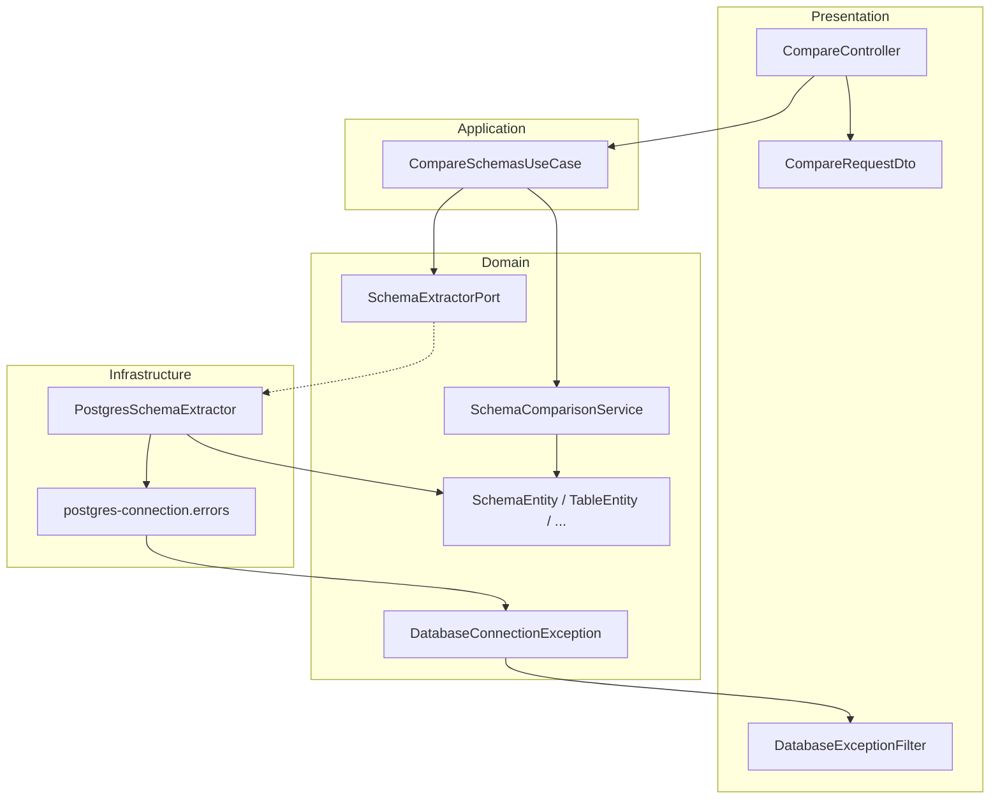

# DB Schema Comparator

API backend em **NestJS** e **TypeScript** para extrair e comparar estruturas de bancos de dados PostgreSQL. Projeto de portfólio focado em **Clean Architecture** e **Arquitetura Hexagonal**, com domínio desacoplado de frameworks e de drivers de banco.

[](https://nestjs.com/)
[](https://www.typescriptlang.org/)
[](https://www.postgresql.org/)
[]()

---

## O problema

Em migrações, ambientes paralelos (dev/staging/prod) ou integrações entre serviços, divergências de schema causam bugs silenciosos. Este projeto automatiza a **detecção de diferenças estruturais** entre dois bancos PostgreSQL via API REST.

---

## O que está implementado

| Funcionalidade | Status |
|---|---|
| Nível 1 (Schema): tabelas, colunas, PK, FK, índices, constraints | ✅ |
| Nível 2 (Objetos): views, functions, procedures, triggers, sequences, enums | 🔜 Roadmap |
| Nível 3 (Dados): contagem, hash, diff por PK, linhas faltantes/alteradas | 🔜 Roadmap |
| Resposta plana com `summary` e lista `differences` por `type` | ✅ |
| Extração PostgreSQL (`information_schema` + `pg_catalog`) | ✅ |
| Tipos de coluna normalizados (`VARCHAR(n)`, `NUMERIC(p,s)`, etc.) | ✅ |
| Injeção de dependência via módulos NestJS | ✅ |
| Tratamento seguro de erros de conexão (timeout 5s, filter HTTP) | ✅ |
| Validação de payload com `class-validator` | ✅ |
| Domínio isolado (entities, contracts, ports, services, exceptions) | ✅ |
| Use cases na camada de aplicação | ✅ |
| Adapter PostgreSQL na infraestrutura | ✅ |
| Suporte MySQL / MongoDB | 🔜 Roadmap |
| Testes automatizados | 🔜 Roadmap |
| Documentação OpenAPI (Swagger) | 🔜 Roadmap |
| Relatórios exportáveis (HTML) | 🔜 Roadmap |
| Múltiplos schemas além de `public` | 🔜 Roadmap |

---

## Níveis de comparação

A API evolui em **três níveis de profundidade**. Cada nível responde a uma pergunta diferente sobre a divergência entre dois bancos PostgreSQL.

| Nível | Foco | Pergunta que responde | Status |
|-------|------|------------------------|--------|
| **1 — Schema** | Estrutura relacional | As tabelas e suas regras estruturais são iguais? | ✅ Implementado |
| **2 — Objetos** | Objetos de banco | Views, rotinas e tipos auxiliares estão alinhados? | 🔜 Roadmap |
| **3 — Dados** | Conteúdo das tabelas | Os registros são os mesmos? | 🔜 Roadmap |

O endpoint atual `POST /compare` cobre exclusivamente o **Nível 1**.

### Nível 1 — Schema ✅

Compara a estrutura relacional no schema `public`.

| Item | `type` na resposta | Status |
|------|-------------------|--------|
| Tabelas | `TABLE_MISSING` | ✅ |
| Colunas | `COLUMN_MISSING`, `COLUMN_TYPE`, `COLUMN_NULLABLE` | ✅ |
| Primary Keys | `PRIMARY_KEY` | ✅ |
| Foreign Keys | `FOREIGN_KEY` | ✅ |
| Índices | `INDEX` | ✅ |
| Constraints (UNIQUE, CHECK) | `CONSTRAINT` | ✅ |

### Nível 2 — Objetos 🔜

Compara objetos PostgreSQL além das tabelas base.

| Item | O que comparar | Fonte típica (PostgreSQL) | Status |
|------|----------------|---------------------------|--------|
| Views | Definição SQL, colunas | `information_schema.views`, `pg_views` | 🔜 |
| Functions | Assinatura, linguagem, corpo | `pg_proc`, `information_schema.routines` | 🔜 |
| Procedures | Assinatura, corpo | `pg_proc` (`prokind = 'p'`) | 🔜 |
| Triggers | Evento, timing, função associada | `information_schema.triggers`, `pg_trigger` | 🔜 |
| Sequences | `start`, `increment`, `min`, `max`, `last_value` | `information_schema.sequences`, `pg_sequences` | 🔜 |
| Enums | Valores do tipo | `pg_type`, `pg_enum` | 🔜 |

Tipos de diff previstos (exemplo): `VIEW_MISSING`, `FUNCTION_MODIFIED`, `TRIGGER_MISSING`, `SEQUENCE_MODIFIED`, `ENUM_VALUE_MISSING`.

### Nível 3 — Dados 🔜

Compara o **conteúdo** das tabelas (não só a estrutura).

| Item | O que comparar | Abordagem típica | Status |
|------|----------------|------------------|--------|
| Contagem de registros | `COUNT(*)` por tabela | Diff quando contagens divergem | 🔜 |
| Hash | Digest por tabela ou por linha | `md5(row_to_json(t)::text)` agregado ou por PK | 🔜 |
| Diferenças por chave primária | Linhas com mesma PK, conteúdo diferente | Join por PK entre A e B | 🔜 |
| Linhas faltantes | PK em A ausente em B (e vice-versa) | `EXCEPT` / anti-join por PK | 🔜 |
| Linhas alteradas | Mesma PK, colunas diferentes | Comparação coluna a coluna | 🔜 |

> **Nota:** o Nível 3 pode ser custoso em tabelas grandes. Previsto: amostragem, limite de linhas ou execução assíncrona.

### Evolução planejada da API

Seleção de níveis no request (comportamento futuro):

```json
{
  "levels": [1, 2, 3],
  "dbA": { "host": "localhost", "port": 5432, "user": "postgres", "password": "secret", "database": "db_source" },
  "dbB": { "host": "localhost", "port": 5432, "user": "postgres", "password": "secret", "database": "db_target" }
}
```

Por padrão, apenas `levels: [1]` (comportamento atual).

Resposta unificada prevista:

```json
{
  "summary": {
    "level1": { "tablesCompared": 52, "equal": 46, "different": 6 },
    "level2": { "objectsCompared": 18, "equal": 18, "different": 0 },
    "level3": { "tablesCompared": 10, "equal": 8, "different": 2 }
  },
  "differences": []
}
```

### Arquitetura por nível (planejada)

```
domain/
├── services/              # Nível 1 — SchemaComparisonService (atual)
├── level-2/               # ObjectComparisonService + entidades (View, Function, ...)
└── level-3/               # DataComparisonService + estratégias (count, hash, pk-diff)

application/
└── compare-schemas.use-case.ts  → orquestra os níveis solicitados
```

Cada nível terá seu extrator, comparador e tipos em `differences`, mantendo o padrão Port/Adapter.

---

## Arquitetura

Separação explícita em camadas, com **inversão de dependência**: o domínio define o contrato (`SchemaExtractorPort`); a infraestrutura implementa o adapter PostgreSQL.



### Módulos NestJS

```
AppModule
 └── PresentationModule
      ├── CompareController
      └── ApplicationModule
           ├── CompareSchemasUseCase
           ├── ExtractSchemaUseCase
           ├── SchemaComparisonService
           └── InfrastructureModule
                └── SCHEMA_EXTRACTOR → PostgresSchemaExtractor
```

### Estrutura do projeto

```
src/
├── main.ts
├── app.module.ts
├── domain/
│   ├── entities/           # Schema, Table, Column, PK, FK, Index, Constraint
│   ├── contracts/          # SchemaComparisonResult
│   ├── ports/              # SchemaExtractorPort + SCHEMA_EXTRACTOR token
│   ├── services/           # SchemaComparisonService, formatters
│   └── exceptions/         # DatabaseConnectionException
├── application/
│   ├── application.module.ts
│   └── use-cases/          # compare-schemas, extract-schema
├── infrastructure/
│   ├── infrastructure.module.ts
│   └── extractors/postgres/
│       ├── postgres-schema-extractor.ts
│       ├── postgres-schema-extractor.queries.ts
│       └── postgres-connection.errors.ts
├── presentation/
│   ├── presentation.module.ts
│   ├── controllers/
│   ├── dtos/
│   └── filters/            # DatabaseExceptionFilter
└── shared/
    └── interfaces/         # DatabaseConfig
```

### Fluxo da requisição

1. `POST /compare` recebe credenciais de dois bancos (`dbA`, `dbB`)
2. DTOs são validados pelo `ValidationPipe` global
3. `CompareSchemasUseCase` extrai o schema de cada banco em paralelo via `SchemaExtractorPort`
4. `SchemaComparisonService` compara os dois schemas (Nível 1 completo)
5. Resposta JSON com `summary` (por tabela) e `differences` (lista plana)
6. Em caso de falha de conexão, `DatabaseExceptionFilter` retorna erro seguro sem derrubar o servidor

---

## Stack

- **Runtime:** Node.js 18+
- **Framework:** NestJS 11
- **Linguagem:** TypeScript 5.7
- **Banco:** PostgreSQL (`pg`)
- **Validação:** class-validator, class-transformer
- **Qualidade:** ESLint, Prettier, Jest (configurado)

---

## Como executar

### Pré-requisitos

- Node.js 18+
- Dois bancos PostgreSQL acessíveis (ou o mesmo host com databases diferentes)

### Instalação

```bash
git clone <url-do-repositorio>
cd db-schema-comparator
npm install
```

### Desenvolvimento

```bash
npm run start:dev
```

A API sobe em `http://localhost:3000`.

### Produção

```bash
npm run build
npm run start:prod
```

### Scripts úteis

| Comando | Descrição |
|---|---|
| `npm run start:dev` | Hot reload |
| `npm run build` | Compila para `dist/` |
| `npm run lint` | ESLint |
| `npm run test` | Jest |
| `npm run test:cov` | Cobertura de testes |

---

## API

### `POST /compare`

Compara os schemas de dois bancos PostgreSQL (schema `public`).

**Request**

```json
{
  "dbA": {
    "host": "localhost",
    "port": 5432,
    "user": "postgres",
    "password": "secret",
    "database": "db_source"
  },
  "dbB": {
    "host": "localhost",
    "port": 5432,
    "user": "postgres",
    "password": "secret",
    "database": "db_target"
  }
}
```

| Campo | Validação |
|---|---|
| `host` | string, obrigatório |
| `port` | inteiro entre 1 e 65535 |
| `user` | string, obrigatório |
| `password` | string, obrigatório |
| `database` | string, obrigatório |

- **Database A** = `dbA` (source na comparação)
- **Database B** = `dbB` (target na comparação)

---

### Response `200 OK`

```json
{
  "summary": {
    "tablesCompared": 52,
    "equal": 46,
    "different": 6
  },
  "differences": [
    {
      "table": "customer",
      "type": "COLUMN_TYPE",
      "column": "name",
      "databaseA": "VARCHAR(100)",
      "databaseB": "VARCHAR(255)"
    },
    {
      "table": "users",
      "type": "COLUMN_MISSING",
      "column": "phone",
      "existsIn": "Database A"
    },
    {
      "table": "invoice",
      "type": "TABLE_MISSING",
      "existsIn": "Database B"
    },
    {
      "table": "users",
      "type": "PRIMARY_KEY",
      "constraint": "users_pkey",
      "databaseA": "(id)",
      "databaseB": "(id, tenant_id)"
    },
    {
      "table": "orders",
      "type": "FOREIGN_KEY",
      "constraint": "fk_orders_customer",
      "databaseA": "user_id → customer(id) ON DELETE CASCADE ON UPDATE NO ACTION",
      "databaseB": "user_id → customer(id) ON DELETE RESTRICT ON UPDATE NO ACTION"
    },
    {
      "table": "users",
      "type": "INDEX",
      "constraint": "idx_users_email",
      "databaseA": "UNIQUE btree (email)",
      "databaseB": "btree (email)"
    },
    {
      "table": "products",
      "type": "CONSTRAINT",
      "constraint": "products_price_check",
      "databaseA": "CHECK ((price > 0))",
      "databaseB": "CHECK ((price >= 0))"
    }
  ]
}
```

### `summary`

| Campo | Significado |
|---|---|
| `tablesCompared` | Total de tabelas na união dos dois bancos (A ∪ B) |
| `equal` | Tabelas sem nenhuma diferença |
| `different` | Tabelas com pelo menos uma diferença |

`equal + different = tablesCompared`

### Tipos de `differences`

| `type` | Descrição | Campos extras |
|---|---|---|
| `TABLE_MISSING` | Tabela existe só em um banco | `existsIn`: `Database A` ou `Database B` |
| `COLUMN_MISSING` | Coluna ausente em um banco | `column`, `existsIn` |
| `COLUMN_TYPE` | Tipo divergente | `column`, `databaseA`, `databaseB` |
| `COLUMN_NULLABLE` | Nullable divergente | `column`, `databaseA`, `databaseB` (`NULL` / `NOT NULL`) |
| `PRIMARY_KEY` | PK ausente ou colunas diferentes | `constraint`, `existsIn` ou `databaseA`/`databaseB` |
| `FOREIGN_KEY` | FK ausente ou regras diferentes | `constraint`, `existsIn` ou `databaseA`/`databaseB` |
| `INDEX` | Índice ausente ou definição diferente | `constraint`, `existsIn` ou `databaseA`/`databaseB` |
| `CONSTRAINT` | UNIQUE ou CHECK ausente/diferente | `constraint`, `existsIn` ou `databaseA`/`databaseB` |

### Response quando schemas são idênticos

```json
{
  "summary": {
    "tablesCompared": 10,
    "equal": 10,
    "different": 0
  },
  "differences": []
}
```

---

### Erros de conexão

Falhas de conexão **não derrubam o servidor**. Timeout de conexão: **5 segundos**.

**Exemplo — credencial inválida em `dbA`** `400 Bad Request`

```json
{
  "statusCode": 400,
  "error": "Database Connection Error",
  "database": "Database A",
  "reason": "AUTH_FAILED",
  "message": "Authentication failed"
}
```

**Exemplo — host inacessível** `502 Bad Gateway`

```json
{
  "statusCode": 502,
  "error": "Database Connection Error",
  "database": "Database B",
  "reason": "UNREACHABLE",
  "message": "Could not reach database host"
}
```

| `reason` | HTTP | Situação |
|---|---|---|
| `AUTH_FAILED` | 400 | Usuário ou senha inválidos |
| `INVALID_DATABASE` | 400 | Database não existe |
| `UNREACHABLE` | 502 | Host/porta inacessíveis |
| `TIMEOUT` | 502 | Conexão expirou (> 5s) |
| `UNKNOWN` | 503 | Outro erro de conexão |

---

### Exemplo com cURL

```bash
curl -X POST http://localhost:3000/compare \
  -H "Content-Type: application/json" \
  -d '{
    "dbA": { "host": "localhost", "port": 5432, "user": "postgres", "password": "secret", "database": "db1" },
    "dbB": { "host": "localhost", "port": 5432, "user": "postgres", "password": "secret", "database": "db2" }
  }'
```

---

## Modelo de domínio

```
SchemaEntity
 └── TableEntity[]
      ├── ColumnEntity[]        (name, type, nullable)
      ├── PrimaryKeyEntity?     (name, columns[])
      ├── ForeignKeyEntity[]    (name, columns, referencedTable, onDelete, onUpdate)
      ├── IndexEntity[]         (name, columns, unique, method)
      └── ConstraintEntity[]    (UNIQUE | CHECK)
```

O extrator PostgreSQL popula esse modelo consultando `information_schema` e `pg_catalog` (schema `public`, apenas `BASE TABLE`).

---

## Contrato de comparação

Tipado em `domain/contracts/schema-comparison-result.ts`:

```
SchemaComparisonResult
 ├── summary: { tablesCompared, equal, different }
 └── differences: SchemaDifference[]
      ├── TABLE_MISSING
      ├── COLUMN_MISSING | COLUMN_TYPE | COLUMN_NULLABLE
      └── PRIMARY_KEY | FOREIGN_KEY | INDEX | CONSTRAINT
```

A comparação de colunas, PKs, FKs, índices e constraints só ocorre em tabelas com o **mesmo nome** nos dois bancos.

---

## Competências demonstradas

- **Clean Architecture** — regras de negócio no domínio, sem dependência de NestJS ou `pg`
- **Ports & Adapters (Hexagonal)** — `SchemaExtractorPort` permite trocar PostgreSQL por outro SGBD sem alterar use cases
- **DI NestJS** — módulos (`Presentation`, `Application`, `Infrastructure`) com injeção por token
- **Use Cases** — orquestração explícita (`CompareSchemasUseCase`, `ExtractSchemaUseCase`)
- **Resiliência** — timeout, fechamento de conexão no `finally`, exceções de domínio + filter HTTP
- **Extração via metadata** — `information_schema` e `pg_catalog` em vez de DDL hardcoded
- **Contratos explícitos** — `SchemaComparisonResult` desacopla o formato da resposta da camada HTTP

---

## Roadmap

### Nível 1 — Schema
- [x] Tabelas
- [x] Colunas (ausentes, tipo, nullable)
- [x] Primary Keys
- [x] Foreign Keys
- [x] Índices
- [x] Constraints (UNIQUE, CHECK)
- [x] Resposta plana com `summary` por tabela
- [x] Injeção de dependência via módulos NestJS
- [x] Tratamento seguro de erros de conexão

### Nível 2 — Objetos
- [ ] Views
- [ ] Functions
- [ ] Procedures
- [ ] Triggers
- [ ] Sequences
- [ ] Enums

### Nível 3 — Dados
- [ ] Contagem de registros por tabela
- [ ] Hash por tabela / por linha
- [ ] Diferenças por chave primária
- [ ] Linhas faltantes
- [ ] Linhas alteradas

### Infraestrutura e produto
- [ ] Parâmetro `levels` no request (`[1]`, `[1,2]`, `[1,2,3]`)
- [ ] Testes unitários e e2e
- [ ] Documentação OpenAPI (Swagger)
- [ ] Adapters MySQL e MongoDB
- [ ] Suporte a múltiplos schemas PostgreSQL
- [ ] Endpoint `POST /extract` (use case já registrado no DI)
- [ ] Relatórios exportáveis (HTML)
- [ ] Comparação por definição (não só por nome de constraint)

---

## Decisões de design

> *"A lógica de negócio não deve depender de frameworks nem de bancos de dados."*

- O domínio expõe interfaces (`SchemaExtractorPort`) e exceções (`DatabaseConnectionException`)
- Novos bancos = novos adapters em `infrastructure/`, sem mudança nos use cases
- Entidades imutáveis (`readonly`) para representar snapshot de schema
- Um `Client` pg executa queries **em sequência** (evita deprecação do driver em pg@9.0)
- Extração de `dbA` e `dbB` permanece **em paralelo** (clients separados)

---

## Autor

Projeto de portfólio backend — arquitetura escalável, engenharia de dados e design de sistemas.

<!-- Opcional: adicione links -->
<!-- [LinkedIn](https://linkedin.com/in/seu-perfil) · [GitHub](https://github.com/seu-usuario) -->
